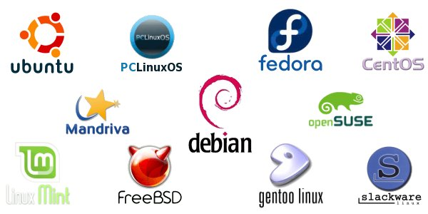
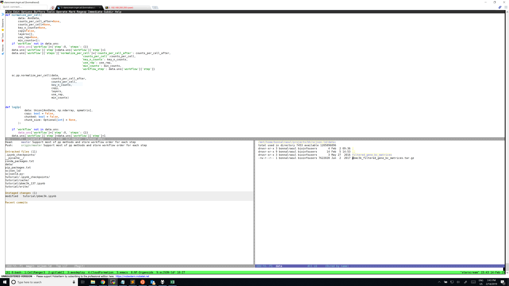
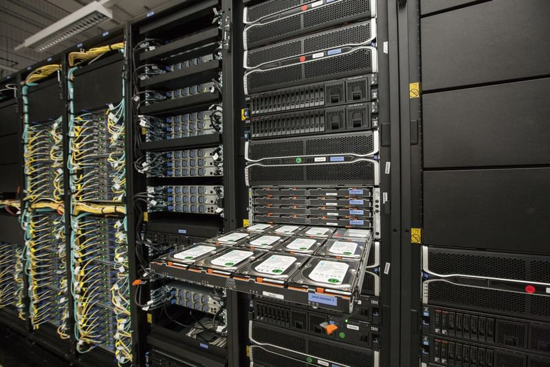

%Reproducibility
%Raoul Bonnal and Marco Passaro
%5-6-7/10/2020

# Tools

## Tools
- Data
- Software
- Computer

# Data

## Data
Can change over time (months or years)

. . .

| Freeze d. | GENCODE | Release d. | Genome v.     | UCSC version |
|-----------|---------|------------|---------------|--------------|
|    5.2018 |      29 |    10.2018 | GRCh38        | 29 (GRCh38)  |
|    6.2014 |      21 |    10.2014 | GRCh38        | -            |
|    7.2013 |      19 |    12.2013 | GRCh37        | 19 (GRCh37)  |
|    7.2011 |      10 |    12.2011 | GRCh37        | 10           |
|   12.2010 |       7 |     4.2011 | GRCh37        | 7            |


## Custom dataset

You can even build your own reference genome(s)

* unkown species
* unkown genes
* ...

----

## Incoming data

Your lab can generate data over time

and 

you must re-analyze it multiple times or combining it in many ways


# Software

## Software

They transform data

. . .

Each transformation has an input and an output

. . .

The output of the previous transformation is the input for the next one

. . .

There are many tools for many purposes and our duty is to combine them in a proper way

## Software

* Operating System (OS)
* Applications
* Bioinformatics Applications

## OS

Linux


----



----

## Linux is open source

Its core code can be inspected and you can contribute !

[torvalds/linux](https://github.com/torvalds/linux)

. . .

It is a very very stable system

. . .

Cluster uptime is about Years

## Linux is Widely used

| Source | Date   |  Unix | Windows | Unkw |
|--------|--------|-------|-----------|------|
| W3Tech | Feb 15 | 36.85 |      32.3 | 30.5 |
| W3Tech | Feb 19 |  69.3 |      30.7 |    0 |

[W3Tech](https://w3techs.com/technologies/overview/operating_system/all)

----

## Linux is Standalone or Remote

You can install Linux main OS or access a remote machine by network



## Linux is Multi user

* Disk ( HDD: long term storage )
* Memory ( RAM: volatile )
* CPU ( engine )

Most of the time you share resources with others

## Linux can be a Cluster of thousands of machines



## Linux is...

- Open Source
- Standalone or Remote
- Multi User
- Cluster of thousands of machines
- Stable
- Huge communities


# Applications

## Applications

Whatever action you are doing through a computer you are using a software

---- 

The functionalities of a computer can be extended installing software

1.  Ubuntu/Debian packages [list](https://packages.ubuntu.com/bionic/) or `apt search`
2.  [Conda](https://conda.io) packages. [search](https://anaconda.org/) or `conda search`
3.  [Linuxbrew](http://linuxbrew.sh/). [List](http://formulae.brew.sh/) or `brew search`
3.  From specialized archives: e.g. `pip`
4.  Compile the program

## Ubuntu packages

*  Lots of packages ready `apt-get install ne`
*  Very robust
*  Additional packages with PPAs `add-apt-repository ppa:user/ppa-name`
   *  Not very useful for science

## Ubuntu packages

Advantages:

*  Safe and efficient
*  Easy to rebuild from source

Cons:

*  Sometimes outdated (Ubuntu LTS are released every 2 years)

## Conda packages

*  Must be downloaded and installed (with bash)
*  Relies on channels
   *  *[base](https://conda.io/en/latest/)* with installation
   *  *[bioconda](https://bioconda.github.io/)*: bioinformatics programs
   *  *[conda-forge](https://conda-forge.org/)*: misc programs
*  Not very robust/stable

## Conda packages

Advantages

*  Programs are usually the latest version

Cons

*  Needs update to config files (`~/.bashrc`)
*  Weird interactions with system programs/libraries
*  Messes up with `$PATH` (e.g. shebang)

## Linuxbrew packages

*  Must be downloaded and installed
*  Only one source of packages
*  Similar to conda
   *  fewer packages


## Conda

On our system is already installed.

The procedure is quite easy if you start from scratch.

 . . .

You can start creating a conda environemnt.

. . .

A conda environment let's you install and use software *softly separated* by the original system 
```bash
conda create -n softwareCollection
```

# Bioinformatic Applications

----

```bash
conda activate softwareCollection
```
Then you are ready to install the application for RNA-seq


----

## Bioinformatic Applications

```
conda install -y -c bioconda \
                 fastqc=0.11.8 \
                 trimmomatic=0.38 \
                 samtools=1.9 \
                 star=2.6.1b
```

# Computer

* Local
* Remote
* Physical
* Virtual
* Cloud
